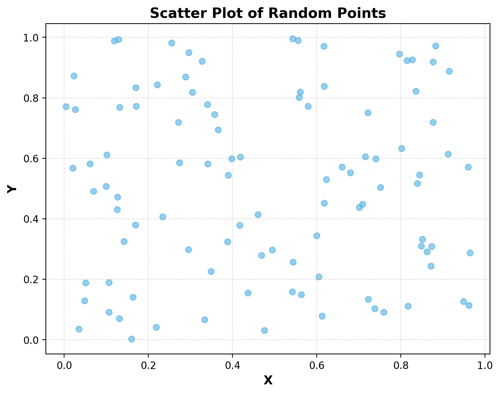
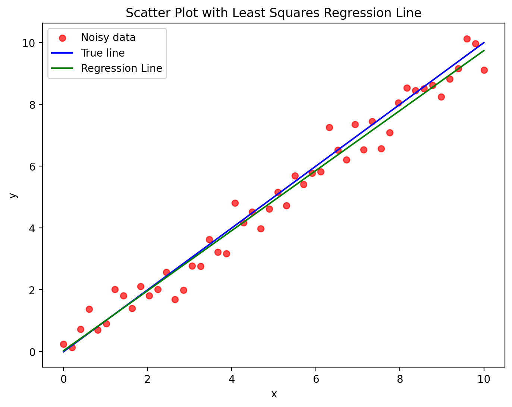
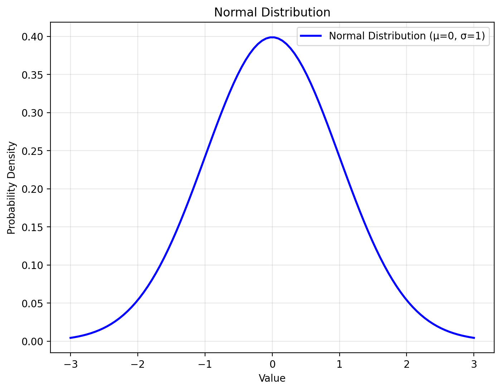
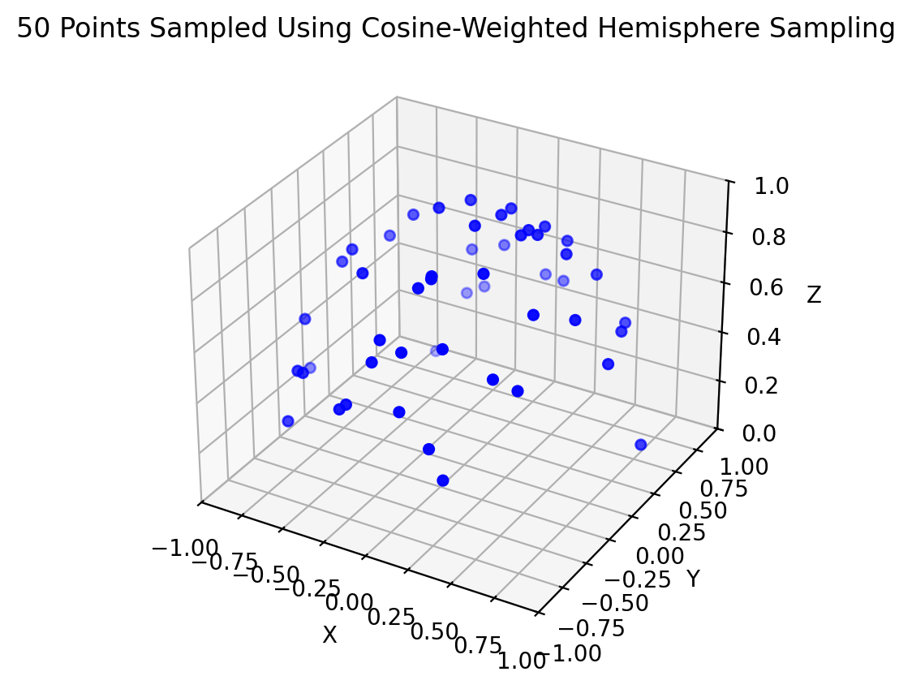

# 📊 PlotLLM: AI Plot Generator


*A simple AI-powered tool to generate Matplotlib plots using natural language prompts.*

---

## 🚀 Introduction
PlotLM is a **Streamlit-based web application** that leverages AI to generate Python Matplotlib plots from user descriptions. It uses the **DeepSeek-R1** model via **Ollama** to generate fully functional, high-quality Python code for data visualization.  

This project serves as a proof of concept. While it is functional, it is built such that the code generated by the underlying LLM model is directly executed to create the requested plots. Therefore, it should not be deployed on a public endpoint in its current state as it is vulnerable to prompt engineering attacks.

## ✨ Features
✅ **AI-Powered Plot Generation** – Describe the plot, and AI writes the Matplotlib code for you.  
✅ **Live Code Execution** – The app runs the generated code and displays the plot instantly.  
✅ **Code Transparency** – View and copy the generated Python code for further customization.  
✅ **Multiple AI Models** – Choose from different `DeepSeek-R1` models based on hardware capabilities. For good results, at least the 14b parameter model should be used as smaller models sometimes suffer from code flaws.   

---

## ✍️ Example Outputs

```
Prompt: Generate a scatterplot with 100 randomly sampled points within [0,1][0,1]
```



```
Prompt: Sample 50 points from f(x) = x and add some normally distributed noise to them. Then plot them together with the least squares regression line for these points
```



```
Prompt: Visualize the normal distribution
```



```
Prompt: Create a 3d plot of 50 points randomly sampled using cosine weighted hemisphere sampling.
```



---


## 🛠️ Installation

### 1️⃣ Prerequisites
Ensure you have the following installed on your system:
- **Tested on Python 3.10.16**
- **Pip (Python Package Manager), use of environment manager is reccomended**
- **Ollama (AI Model Service)** – Install from [Ollama's official website](https://ollama.ai).

---

### 2️⃣ Clone the Repository
```bash
git clone https://github.com/SvenPfiffner/PlotLLM.git
cd PlotLLM
```

---

### 3️⃣ Create a Virtual Environment (Recommended)
```bash
python -m venv venv
```

---

### 4️⃣ Install Dependencies
```bash
pip install -r requirements.txt
```

---

### 5️⃣ Run the Application
Make sure **Ollama** is running before starting the app:
```bash
ollama serve
```
Then, start **PlotLLM**:
```bash
streamlit run ui.py
```

---

## 📸 Usage
1. Open the **PlotLLM** web interface in your browser.
2. Describe the plot you want (e.g., *"Generate a bar chart for sales data of 3 products."*).
3. Select an AI model from the sidebar.
4. View the generated Python code and the rendered plot.
5. Copy the code for further use or modifications.

---

## 🛡️ Security Warning
⚠️ **Generated code is automatically executed**. Be cautious when using user-provided inputs, as malicious prompts could result in arbitrary code execution.


---

## 🎯 Roadmap & Future Improvements

**Note: I will not have the time to develop this project further than the proof-of-concept phase atm. However, contributions are more than welcome.**

- [ ] Improve security to prevent arbitrary code execution.
- [ ] Add an option for users to upload datasets for plotting.
- [ ] ...

---

## 🤝 Contributing
Contributions are welcome! Here’s how you can help:
1. **Fork the Repository**  
2. **Create a Feature Branch** (`git checkout -b feature-branch`)  
3. **Commit Your Changes** (`git commit -m "Add a new feature"`)  
4. **Push to Your Branch** (`git push origin feature-branch`)  
5. **Create a Pull Request**  

---

## 📝 License
This project is licensed under the **MIT License**. See `LICENSE` for details.

---

## 🙌 Acknowledgments
- **[DeepSeek-R1](https://www.deepseek.com/)** – AI model used for reasoning.
- **[Ollama](https://ollama.ai/)** – AI service used for running DeepSeek models.
- **[Streamlit](https://streamlit.io/)** – Web framework for the UI.

---
